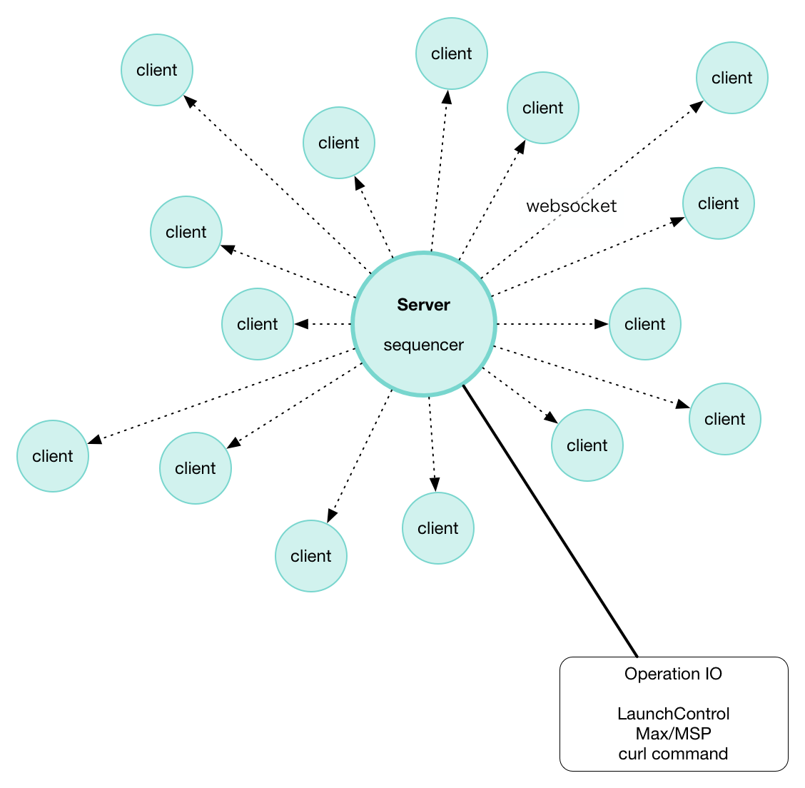
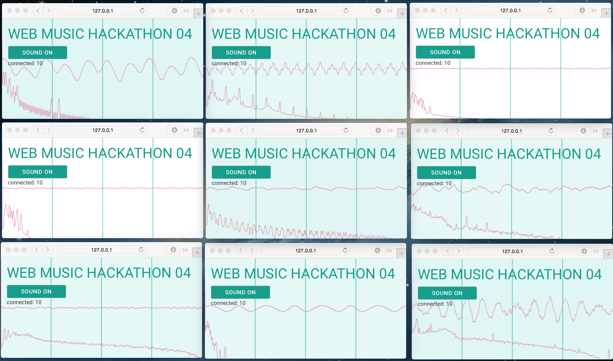
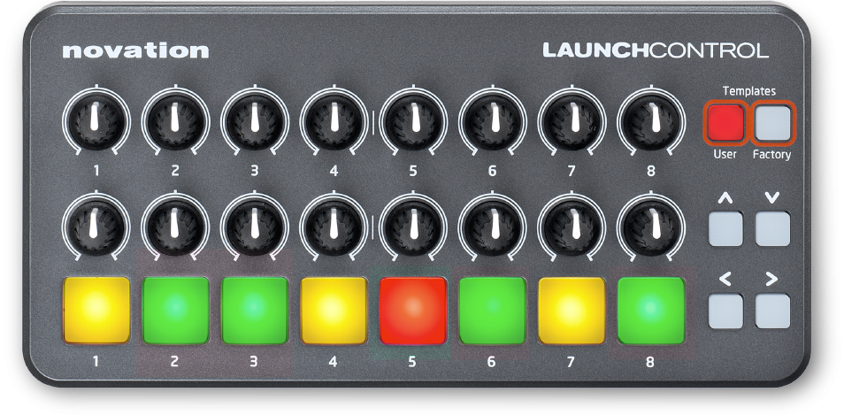
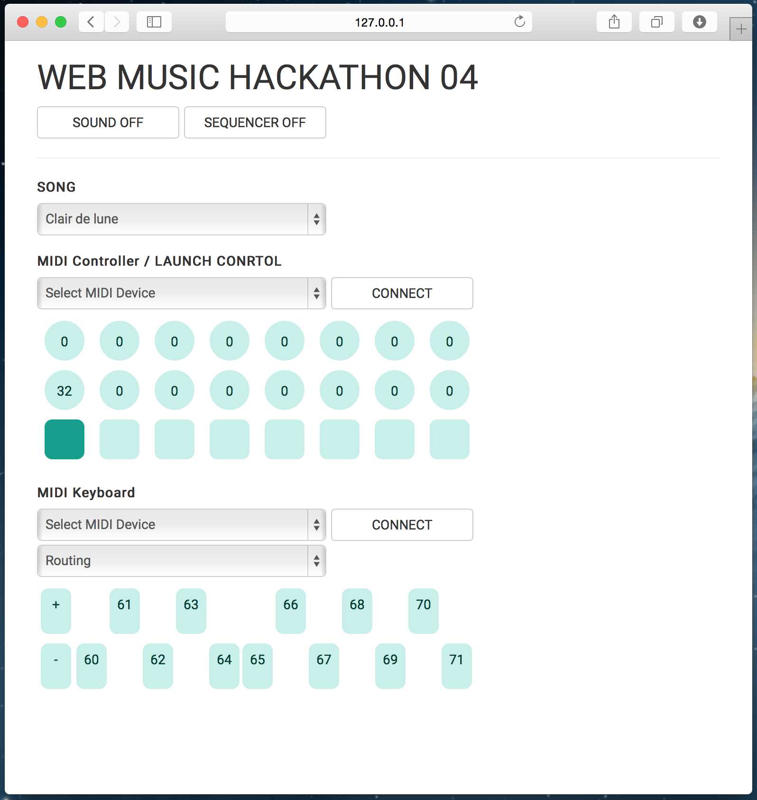

# Distributed Sequencer
[](https://travis-ci.org/mohayonao/web-music-hackathon-04)

## DESCRIPTION
The project's concept is to generate common experience by personal devices.

I developed a music sequencer that takes advantage of space like a small room.
Several browsers located dispersedly are received playback information via web socket, and play it like individual instruments. Player operate sequence parameters as a conductor. And listeners are surrounded in sound.

This project has been developed for [Web Music Hackathon #4 Kyoto](https://atnd.org/events/67782) on 2015/07/25.

## ARCHITECTURE IMAGE


inspired from [線香花火](https://ja.wikipedia.org/wiki/%E7%B7%9A%E9%A6%99%E8%8A%B1%E7%81%AB)

## AUTHOR
- [@mohayonao](https://github.com/mohayonao)

## CONTRIBUTORS
- [@esperia](https://github.com/esperia) : user interaction
- [@isocoda](https://github.com/isocoda) : user interaction
- [@yasuraok](https://github.com/yasuraok) : visualization

## HOW TO DEMONSTRATION
1. `git clone https://github.com/mohayonao/web-music-hackathon-04.git`
2. `cd web-music-hackathon-04`
3. `npm install`
  - install dependencies
4. `npm run build`
  - build JavaScript endpoint
5. connect LaunchControl to the server PC, if you have.
6. `npm run start`
  - start web server on port 3000
7. open `http://${SERVER_HOST}:3000/` on your browsers

##### Note

Please prepare at least 10 clients and a good performance wifi router.



## HOW TO OPERATION

##### LaunchControl

[](http://us.novationmusic.com/launch/launch-control)

- pad: toggle track mute

| # | track name | upper knob    | lower knob    |
|---|------------|---------------|---------------|
| 1 | sine tone  | modulation    | sustain level |
| 2 | keyboard   | _not use_     | _not use_     |
| 3 | lead       | filter cutoff | filter Q      |
| 4 | pad        | _not use_     | _not use_     |
| 5 | bass       | _not use_     | _not use_     |
| 6 | delay      | feedback      | gate          |
| 7 | noise      | _not use_     | _not use_     |
| 8 | effect     | _not use_     | speed         |

- cursor key
  - :arrow_up_small: start sequencer
  - :arrow_down_small: stop sequencer
  - :arrow_backward: tempo --
  - :arrow_forward: tempo ++

##### `curl` command

```sh
# start sequencer
curl -v 127.0.0.1:3000/start

# stop sequencer
curl -v 127.0.0.1:3000/stop

# toggle track mute (track)
curl -v 127.0.0.1:3000/pad/[0-8]

# update knob parameter (track/value)
curl -v 127.0.0.1:3000/knob1/[0-8]/[0-127]
curl -v 127.0.0.1:3000/knob2/[0-8]/[0-127]
```

##### Max/MSP

- assets/hack-controller.maxpat

##### Smartphone
You can apply smartphone's orientation to track3 parameters when opening with `#ctrl`.

- `http://${SERVER_HOST}:3000/#ctrl`

## STANDALONE EDITION
This edition is not used a web server. You can try from now on without installation.

- http://mohayonao.github.io/web-music-hackathon-04/



## USED TECHNOLOGY
- [ES6 / Babel](https://babeljs.io/)
- [React](http://facebook.github.io/react/)
- [Flux Architecture](http://facebook.github.io/flux/)

## LICENSE
MIT
